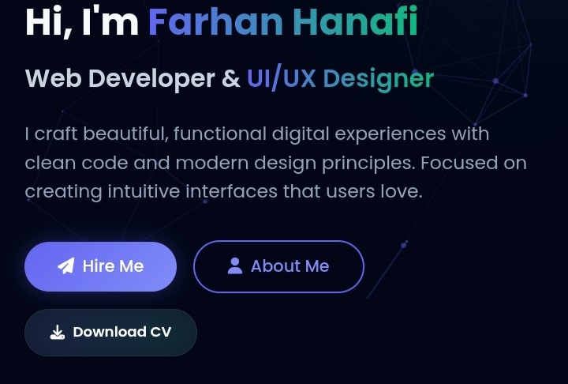

# 🌐 Farhan Hanafi | Personal Portfolio

Selamat datang di repositori **Farhan Hanafi's Personal Portfolio Website**.  
Website ini merupakan _clone_ dari project utama yang dapat diakses di:  
👉 **[https://frhndevweb.my.id](https://frhndevweb.my.id)**

> **⚠️ Note:**  
> Kalau kamu ingin **versi project asli-nya** (yang full dan premium), silakan hubungi via WhatsApp:  
> 📲 [https://wa.me/+6288215660319](https://wa.me/+6288215660319)
> 
> 
> 
> **Eits, tapi gak gratis yaa**, karena ini pure buatan sendiri — dari desain sampai fungsinya.

---

## 🔧 Tech Stack

- **HTML5**
- **Tailwind CSS** (via CDN)
- **JavaScript**
- **AOS (Animate on Scroll) Library**
- **Font Awesome**

---

## 📁 Struktur Folder

```
.
├── index.html             # Halaman utama website
├── style.css              # Kustomisasi CSS tambahan
├── script.js              # Script interaktif (menu toggle, scroll, skill animasi)
├── site.webmanifest       # Konfigurasi PWA manifest
├── src/
│   ├── profil.png         # Foto profil
│   └── favico/            # Ikon-ikon favicon untuk berbagai perangkat
│       ├── apple-touch-icon.png
│       ├── favicon-16x16.png
│       ├── favicon-32x32.png
│       ├── android-chrome-192x192.png
│       ├── android-chrome-512x512.png
```

---

## 🚀 Fitur Unggulan

- Desain responsif dan elegan
- Navigasi dengan smooth scroll
- Skill progress bar animasi saat scroll
- Aktifkan link nav saat scroll ke section tertentu
- Mobile-friendly toggle menu
- SEO dan Meta tag sosial media (Open Graph dan Twitter Card)

---

## 📦 Cara Menjalankan

1. Clone repositori ini:

   ```bash
   git clone https://github.com/username/portfolio-farhan-hanafi.git
   ```

2. Buka `index.html` di browser favoritmu.

---

## 👤 Tentang Saya

Farhan Hanafi adalah seorang Web Developer dan UI/UX Designer yang antusias terhadap dunia teknologi, desain minimalis, dan efisiensi dalam menulis kode.

---

## 📬 Kontak

- 🌐 Website: [https://frhndevweb.my.id](https://frhndevweb.my.id)
- ✉️ Email: farhanhanafi656@gmail.com
- 📱 Instagram: [@hannaaffiii](https://instagram.com/hannaaffiii)
- 💬 WhatsApp: [https://wa.me/+6288215660319](https://wa.me/+6288215660319)

---

## 📄 Lisensi

Proyek ini dilisensikan di bawah [MIT License](LICENSE).
